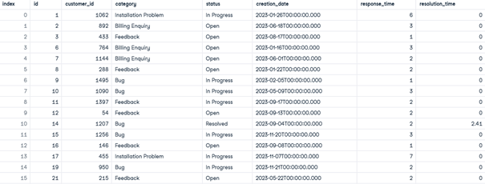
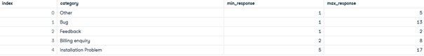
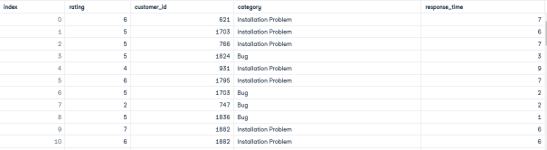

# Customer Support Analysis Case Study

## Description
This project involves analyzing customer support data for Tech Solutions Inc., a leading technology company. The analysis aims to identify factors contributing to customer dissatisfaction and provide actionable insights. The tasks are structured to highlight SQL skills and techniques, with a focus on data cleaning, aggregation, and key performance indicators (KPIs).

---

## Objectives
The analysis addresses the following business questions:
1. How accurate and consistent is the support ticket data?
2. What are the response time ranges for different support categories?
3. What are the ratings provided by customers reporting bugs or installation problems?
   
---

## Tasks and Techniques

### Task 1: Data Cleaning and Normalization

#### Objective:
Ensure the accuracy and consistency of the `support` table based on predefined criteria.

#### Techniques Demonstrated:
- **NULL Handling**: Replacing missing values with default values using `COALESCE`.
- **Data Standardization**: Normalizing categorical values with `CASE` and `TRIM`.
- **Date Formatting**: Ensuring consistent date formats using `TO_CHAR`.
- **Precision Handling**: Rounding numerical values to two decimal places.
- **Filtering by Date**: Restricting data to the year 2023 with `WHERE` clauses.

#### Insights:
- Successfully cleaned and standardized data ensures consistency across categories, statuses, and timestamps.
- Missing values were effectively replaced with business-defined defaults to maintain data integrity.

#### Screenshot:

---

### Task 2: Response Time Analysis

#### Objective:
Identify the minimum and maximum response times for each support category.

#### Techniques Demonstrated:
- **Aggregation**: Using `MIN` and `MAX` functions to calculate range metrics.
- **Rounding**: Applying `ROUND` to format numerical results.
- **Grouping**: Leveraging `GROUP BY` to analyze response times per category.

#### Insights:
- Categories with the longest response times can be prioritized for process optimization.
- Identifying outliers in response times provides a starting point for targeted interventions.

#### Screenshot:

---

### Task 3: Customer Ratings for Key Issues

#### Objective:
Analyze customer ratings for tickets categorized as "Bug" or "Installation Problem."

#### Techniques Demonstrated:
- **Table Joins**: Combining `support` and `survey` tables using `JOIN`.
- **Conditional Filtering**: Extracting data for specific categories with `WHERE`.
- **Column Selection**: Focusing on relevant fields (rating, customer ID, category, response time).

#### Insights:
- Direct correlation between ticket resolution metrics (e.g., response time) and customer ratings.
- Categories such as "Bug" and "Installation Problem" show patterns in customer dissatisfaction.

#### Screenshot:

---

## Key Performance Indicators (KPIs)
The following KPIs were derived from the analysis:
1. **Average Response Time** per category.
2. **Customer Satisfaction Ratings** for critical issue types.
3. **Resolution Time Distribution** for the year 2023.

---

## To Go Further

### Recommendations:
1. **Process Improvements**:
   - Reduce response times for categories with higher dissatisfaction.
   - Implement escalation procedures for "Bug" and "Installation Problem" tickets.
2. **Customer Feedback Integration**:
   - Use satisfaction ratings to guide training and resource allocation for the support team.
3. **Data Monitoring**:
   - Regularly audit support data to ensure ongoing data quality.

### Advanced Analysis:
1. **Time Series Analysis**:
   - Analyze trends in ticket volumes and response times over months.
2. **Predictive Modeling**:
   - Build models to predict ticket resolution times based on ticket attributes.
3. **Interactive Dashboards**:
   - Develop dashboards to visualize ticket trends and KPIs dynamically.

---

## Disclaimer
This project is based on a sample SQL exam provided by DataCamp. All intellectual property rights belong to DataCamp. This analysis is shared solely for educational purposes and portfolio development.
